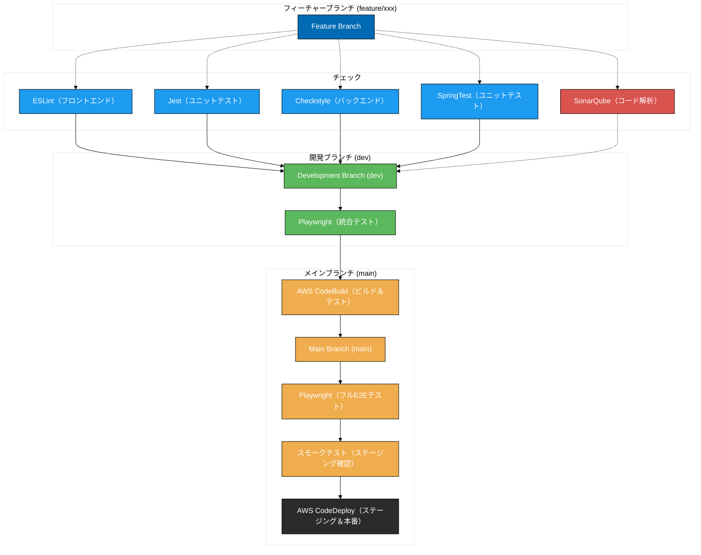

# CI/CD ワークフロー提案

## 1. 概要
本提案では、フロントエンドおよびバックエンドの両方に対するテストやコード解析を、開発プロセスの各ブランチ（feature、dev、main）ごとに段階的に実施する仕組みを示します。
- **feature/xxx ブランチ**: 個別の機能追加・修正を行うためのブランチ。フロントエンド・バックエンドの基本的なチェックとユニットテストを中心に実行。
- **dev ブランチ**: 各 feature/xxx ブランチで開発された機能を統合してテストするためのブランチ。Playwright を用いた統合テストを実施し、環境依存の動作確認を行う。
- **main ブランチ**: 本番運用を想定した安定版ブランチ。フル E2E テストやステージングでのスモークテストを行い、最終的に AWS CodeDeploy を通じてステージングおよび本番環境にデプロイする。

## 2. ブランチごとのテスト & チェック概要

1. **feature/xxx ブランチ**
   - **フロントエンド**
     - ESLint でコードスタイルのチェック
     - Jest で UI 部分を含むユニットテスト
   - **バックエンド**
     - Checkstyle で Java コードのスタイルをチェック
     - SpringTest (JUnit) でユニットテスト
     - SonarQube でコード解析（カバレッジやセキュリティホットスポット検出など）

2. **dev ブランチ**
   - feature/xxx ブランチからのマージ後、機能間の整合性や API・DB の連携をテスト
   - フロントエンド・バックエンド間を横断する統合テストとして、Playwright を実行
   - DB（SQL Server など）やバックエンドサービスなどの実際のインフラとのやり取りを確認

3. **main ブランチ**
   - dev ブランチからのマージ後にフル E2E テストを実行（Playwright）
   - ステージング環境でのスモークテストを実施し、問題がなければ AWS CodeDeploy を通じて本番環境へ自動 or 手動承認後デプロイ

## 3. デプロイフロー概要 (AWS Integration)
1. **AWS CodeBuild (Build & Test)**
   - コードを取得し、依存ライブラリをインストール
   - 指定されたチェックとユニットテスト・統合テストなどを自動実行
2. **AWS CodeDeploy (Staging & Prod)**
   - Staging 環境へのデプロイを自動化し、スモークテストで動作確認
   - 承認（手動 or 自動）を経て、Production 環境へデプロイ
3. **通知・ログの取得**
   - 失敗時の Slack やメール通知を設定
   - Build ログやテスト結果は AWS CloudWatch などでモニタリング

## 4. Mermaid 図: CI/CD ワークフロー

以下の Mermaid 図は、Feature ブランチから Main ブランチまでのテスト・デプロイフローの概要を示しています。

---

## 5. 今後のステップ

1. **導入テスト・PoC**
   - このフローの一部をスモールスタートし、動作確認と社内展開の準備
2. **検証と最適化**
   - 実際に運用してみてビルド時間やテストの負荷が大きい場合、テストの並列化や段階的実行を検討
3. **運用マニュアルの充実**
   - 追加ドキュメント（環境構築手順、トラブルシューティング、承認プロセスなど）を整備

---

## SonarQube を効果的に活用する

## 1. SonarQube の役割
- **静的解析プラットフォーム**として、バグや脆弱性・コードの悪臭（Code Smells）を検出。
- **Quality Gate**により、一定の基準（カバレッジ、重大度など）を満たさないとリリースをブロック。

## 2. 初期設定・統合
1. **インストール/セットアップ**: 自前サーバーか SonarCloud を選択。
2. **CI/CD 統合**: Jenkins、GitHub Actions、Bitbucket Pipelines 等でビルド後に SonarQube スキャナを実行。
3. **ルール設定**: プロジェクトにあったルールを選択し、ノイズを減らす。

## 3. Quality Gate と Quality Profile
- **Quality Gate**: “新規コードのカバレッジ○％以上” など具体的な合格ラインを設定。
- **Quality Profile**: 使用する言語別に最適なルールセットを定義。

## 4. 効果的な活用ポイント
- **新規コード重視**: 新たに加えたコードは必ず高品質を保つ（レガシーには段階的に対処）。
- **優先度管理**: Blocker/Critical を最優先で修正。
- **CI パイプライン必須化**: ビルドが通らないとリリースできない仕組みにする。

## 5. よくある落とし穴
- **ルールの過剰設定**: 警告だらけで開発者が疲弊。必要なルールに絞り、徐々に拡張。
- **アップデート不足**: SonarQube 本体やプラグインの更新を怠ると、新しい脆弱性検出が漏れる。
- **チームへの周知不足**: 開発者が結果を見ないと改善に結びつかない。

## 6. まとめ
SonarQube は継続的にコード品質を監視し、開発プロセスへ組み込むことで技術的負債やセキュリティリスクを低減する強力なツールです。新規コードの質を確保しつつ、優先度の高い問題から着実に修正を進める運用が最も効果的です。